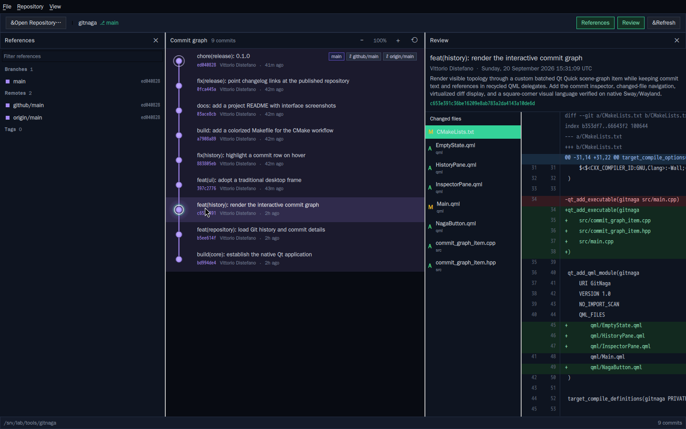
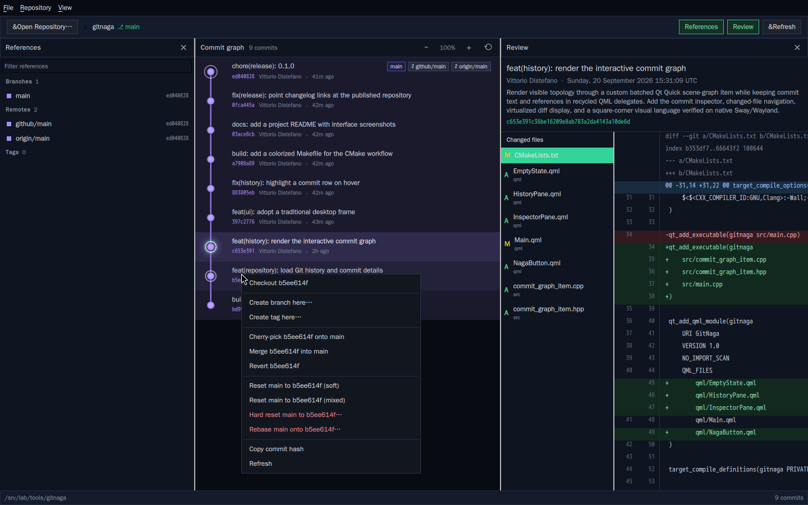
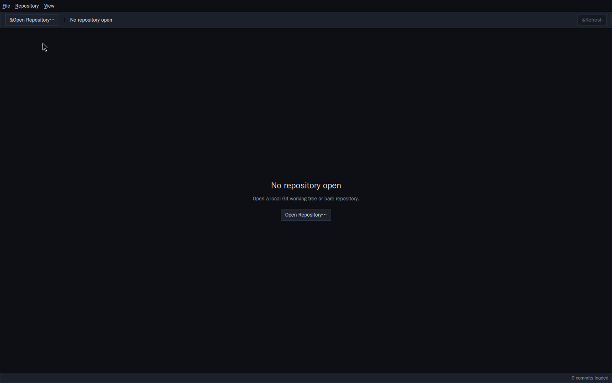

# GitNaga

[](https://github.com/blackopsrepl/gitnaga/actions/workflows/ci.yml)

<p align="center">
  
</p>

A native Linux Git history and diff viewer built with C++23 and Qt 6 QML. The
commit graph sits in the centre with its own branch colour, the references and
review live in closable sidebars, and every Git action is one right-click away
on the graph. It talks to Git directly and needs no daemon, no library wrapper,
no account, and no telemetry.

## Highlights

- **Centre stage graph.** The graph is the main surface. Each row carries a
  tint of its branch colour, commits are drawn as avatars ringed by their branch
  colour, merges get a heavier marker, and the current branch tip is
  highlighted. Avatars are resolved without any network access: a local image
  from the cache directory when present, otherwise a deterministic monogram for
  the author. It is painted with
  Qt's anti-aliased vector painter, so curves and gradients stay crisp at any
  zoom.
- **Mouse first.** Hover to trace a row, click to select, drag to pan, wheel to
  scroll, and Ctrl+wheel to zoom around the cursor. Toolbar controls and
  keyboard shortcuts mirror the same actions.
- **Right-click Git operations.** Right-click any commit for checkout, branch
  and tag creation, cherry-pick, merge, revert, reset (soft, mixed, hard),
  rebase, branch deletion, and copy hash. Right-click empty graph space for a
  refresh. Destructive actions ask for confirmation.
- **Uncommitted work in view.** A pending row sits above HEAD whenever the
  worktree differs from it, holding the real diff of staged, unstaged, and
  untracked changes. It is an ephemeral commit object, so reviewing it uses the
  same inspection and diff paths as any other commit without touching the
  repository's own index.
- **References, not a duplicate list.** The left sidebar lists local branches,
  remotes, and tags from the refs Git actually stores, with a filter box and a
  context menu. The right sidebar is the review: metadata, changed files, and
  the coloured diff.
- **Closable, resizable panes.** Toggle the references and review sidebars
  from the toolbar (or Ctrl+1 / Ctrl+2) and the graph takes the full window.
  Every pane is a splitter you can drag.
- **Responsive by construction.** Every Git command runs off the GUI thread.
  Stale results are dropped by generation counter, and `.git` metadata is
  watched so the view refreshes when the repository changes underneath it.

## Screenshots

<p align="center">
  
</p>

<p align="center">
  
</p>

## Build and run

GitNaga needs a C++23 compiler, CMake 3.31 or newer, Ninja, and Qt 6.9.1 or
newer with the Quick, QuickControls2, and Concurrent modules.

```bash
make            # show the available targets
make build      # configure and build the debug preset
make run REPO=/path/to/repository
```

Without Make, the underlying CMake presets are the same:

```bash
cmake --preset dev
cmake --build --preset dev
./build/dev/gitnaga /path/to/repository
```

Passing a repository path is optional. With no argument, GitNaga opens on an
empty state and waits for the **Open Repository** button (or Ctrl+O).

## Verify

```bash
make test       # build and run the ctest suite
make lint       # lint every QML file with qmllint
make ci-local   # configure, build, test, and lint in one pass
```

The integration test runs against a real scratch repository and covers
discovery, merge topology, commit inspection, diff output, and the branch, tag,
and reset operations. A graph test covers the lane geometry and palette, and a
source-size contract rejects any source, QML, or test file at or above 300
lines.

## Layout

See [`WIREFRAME.md`](WIREFRAME.md) for the precise interface specification:
regions, dimensions, colours, pointer and keyboard maps, state matrix, and data
bindings.

| Path | Contents |
|------|----------|
| `src/git_client.*` | Git discovery, history, refs, and mutation execution |
| `src/git_inspect.cpp` | Commit inspection and per-file diff loading |
| `src/git_parse.*` | Lane assignment and unified-diff parsing |
| `src/repository_controller.*` | Asynchronous repository, selection, and operation state |
| `src/repository_operations.cpp` | Typed Git operations exposed to QML |
| `src/repository_references.cpp` | Branch, remote, and tag references for the sidebar |
| `src/graph_geometry.*` | Lane layout, node, and edge-curve geometry |
| `src/commit_graph_item.*` | Graph input, metrics, and model binding |
| `src/commit_graph_paint.cpp` | Anti-aliased vector painting of the graph |
| `qml/GraphPane.qml` | Centre graph surface with zoom controls |
| `qml/CommitLabels.qml` | Commit label overlay riding the graph, with reference badges |
| `qml/ReferencesPane.qml` | Closable references sidebar |
| `qml/InspectorPane.qml` | Closable review sidebar |
| `qml/CommitMenu.qml` | Right-click Git operations popup |
| `tests/` | Real-Git integration test, graph geometry test, palette test, work-in-progress test, smoke test |

## License

GPL-3.0-or-later. See [LICENSE](LICENSE).
